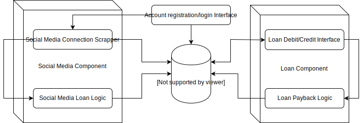

# Social Score Lending

## Block diagram

1. **Social Media Component:** This component is responsible for the aggregration and processing of social media data.
    1. **Social Media Connection Scrapper:** This block is responsible for aggregrating the social media metrics which would be consumed by the loan amount logic.
    2. **Social Media Loan Logic:** This block is responsible for calculating how much loan can the user issue based on the gathered metrics.
2. **Account registration and login interface:** This component is responsible for secure registration of new users and logins.
3. **Userdata storage database:** This central database would store all the persistent data necessary for the application. This includes social media metrics, user and account information.
4. **Loan Component:** This component is responsible for issuing loans and tracking their payback. 
    1. **Loan Debit/Credit Interface:** This block is responsible for the UI and related logic for the loaning interface.
    2. **Loan payback logic:** This block keeps track of payments and outstanding amount. It also calculates and applies the interest rate.