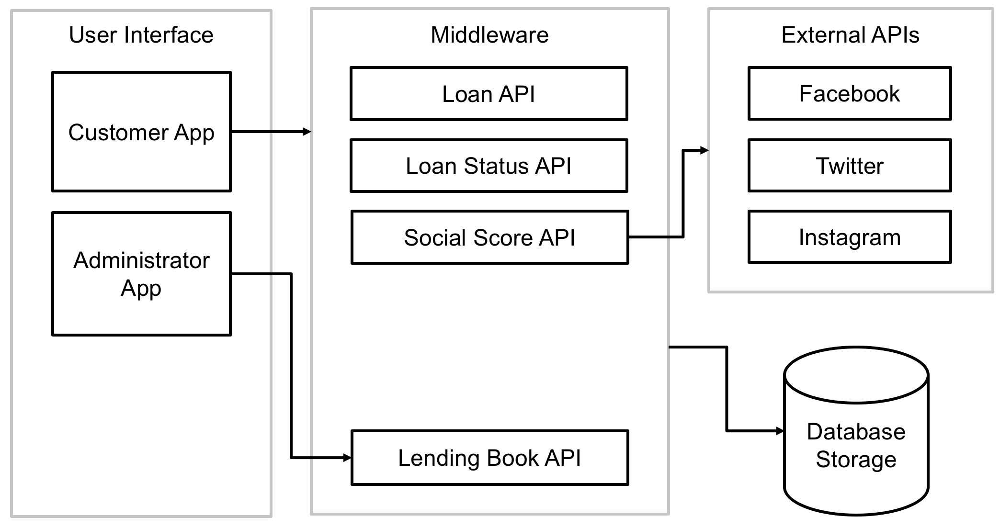
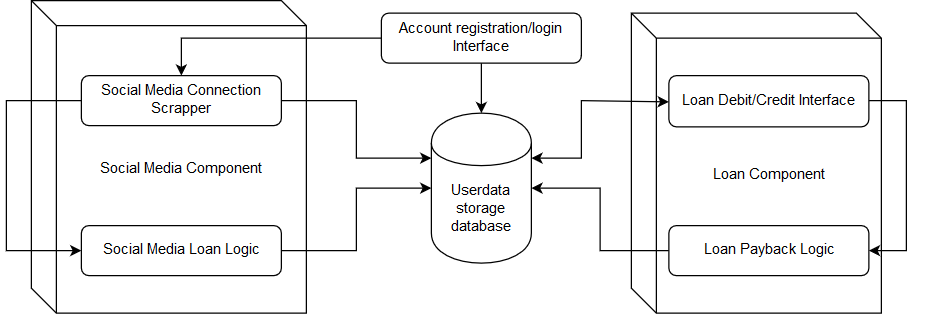
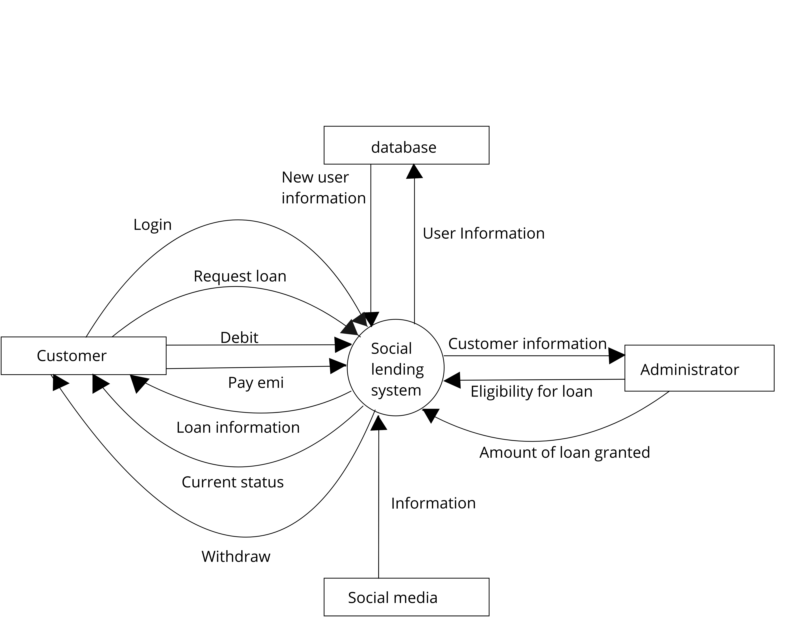
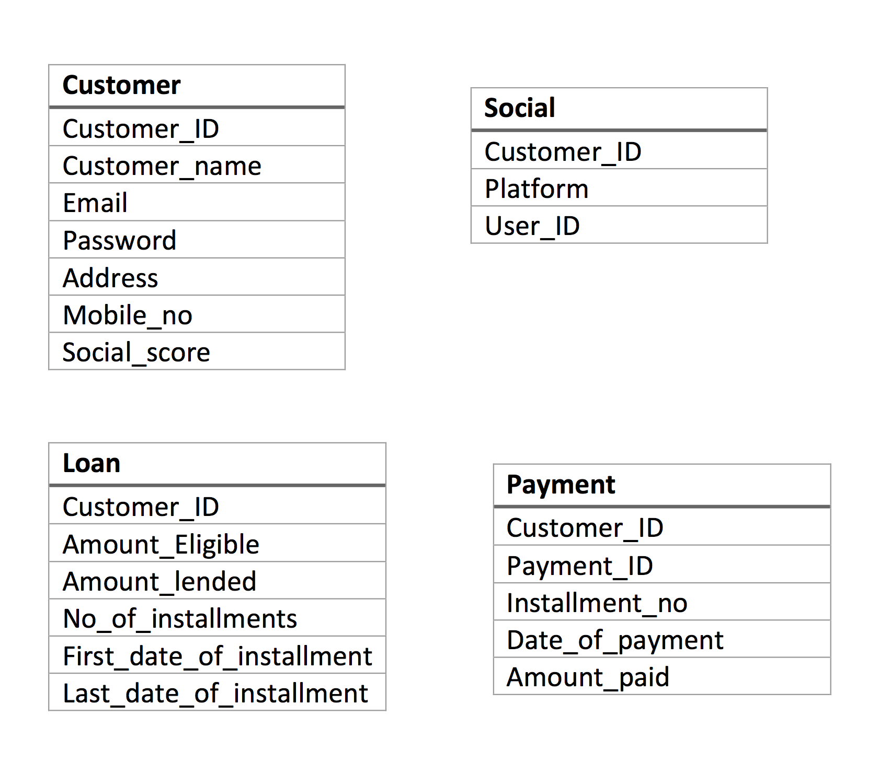

# Social Lending Platform

## Objective

Our aim is to develop a social lending platform that supports the following base features.

- Users can login to the application.
- Users will get a social score and eligibility amount for lending.
- Some metrics that qualify as social exposure are
  - Count of friends on Facebook, Instagram and Twitter
  - Post frequency and post lengths
  - Community responses on posts to access acceptability of user
- Users can borrow from the platform and pay back installments through screen based actions.
- Administrator is able to view the lending work for the platform. (i.e. a simple ledger)
- Implement an API to show the current status of loan amount by user.

## Simplifications

1. Zero interest on loans.
2. No Banking fees on transactions.
3. Deposits and withdrawals are only allowed through application screens.
4. API to expose the lending statement may not be secured.

## Use cases

1. Register a new user using social platforms.
2. Link more social platform accounts.
3. Login to an existing account.
4. Give certain accounts admin privilege.
5. Users can view their social score, loan amount eligibility and view outstanding loans.
6. Users can request loan.
7. Users can pay installments.
8. Admins can view and disable accounts.

## Workflow

### 1.	Register a new user using social platforms.
_Actors_ – User, Our Platform  
_Description_ – This use case describes how to register using social account.  

#### Normal Workflow –
  1.	The user will click on the **sign up with X** button on the home page, where **X** is the social platform.
  2.	The user will give permission to our app to access their details, which is public information and number of social contacts.
  3. The user be redirected to their dashboard.

#### Alternate Workflow -  
##### If user does not provide access
  1.	The app will display an error message.
  2.	Registration will be discontinued.

### 2.	Link more social platform accounts.
_Actors_ – User, Our Platform  
_Description_ – This use case describes how to add more social media platforms.

#### Normal Workflow –
  1.	The user will click on the **Link X account** button on the home page, where **X** is the social platform.
  2.	The user will give permission to our app to access their details, which is public information and number of social contacts.
  3. The user be redirected to their dashboard.

#### Alternate Workflow -  
##### If user does not provide access
  1.	The app will display an error message.
  2.	Linking will be discontinued.

### 3.	Use Case – Login to an existing account.
_Actors_ – User, Our Platform  
_Description_ – This use case describes how the user with an existing account would login to our platform.

#### Normal Workflow –
  1.	The user will click on the **Login with X** button on the home page. Where **X** is the social platform.
  2. The user be redirected to their dashboard.

#### Alternate Workflow -  
##### If user is not logged in
  1. The user will be prompted to login to their social media platform.
  2. If the result is failure, the login is aborted.

##### If user is disabled by an admin
  1. The error message will be displayed.

### 4.	Use Case – Give certain accounts admin privilege.  
_Actors_ – Admin, Admin Platform  
_Description_ – This use case describes how certain users can login as admins.

#### Normal Workflow –
  1.	The user will click on the **Login with username and password**.
  2. The user be redirected to their admin dashboard.

#### Alternate Workflow -  
##### If credentials are invalid
  1. Error message will be displayed.
  2. Login is aborted.

### 5.	Use Case – Users can view their social score and loan amount eligibility.
_Actors_ – User, Our Platform  
_Description_ – This use case describes how users can view their social score, amount of loan they can get and their outstanding loans.

#### Normal Workflow –
  1.	The user will click on individual options for more details, if applicable.

### 6.	Use Case – Users can request loan.
_Actors_ – User, Our Platform  
_Description_ – This use case describes how users can request a loan.

#### Normal Workflow –
  1. The user can click on `Apply for loan` button on the dashboard.
  2. The user can choose the amount for loan.
  3. The user can choose the total duration.
  4. The user can choose the frequency of installments. (Monthly, Half-yearly, Yearly)

#### Alternate workflow -

  2. User has entered a loan higher than allowed, it would be set to maximum allowed.
  3. User has entered a duration higher than valid, it would be set the maximum allowed.

### 7.	Use Case – Users can pay installments.
_Actors_ – User, Our Platform  
_Description_ – This use case describes how users can pay their EMI.

#### Normal Workflow –
  1. The user can click on `Pay outstanding installments` button on the dashboard.
  2. The amount will be redirected to their payment portal.
  3. On successful payment, the outstanding amount will be updated.

#### Alternate workflow -

##### On transaction failure
  1. Failure message with these two options **Try again now** or **Try later**.
  2. If user presses try later then user will be redirected to the dashboard. Otherwise another attempt will be made with the payment portal.

### 8.	Admins can view and disable accounts. 
_Actors_ – Admin, Admin Platform  
_Description_ – This use case describes how admin can view and close accounts.

#### Normal Workflow –
  1. The admin will view a table of all users with a search bar.
  2. The admin can click on each user to see additional data.
  3. The admin can click the disable account button on the same row.

## Architecture Diagram

## Block Diagram

## Context Diagram

## Data Model Diagram

## Use Case Diagram

