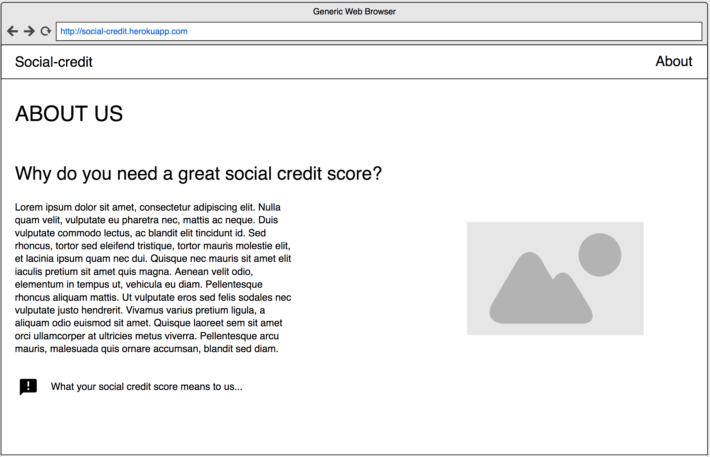
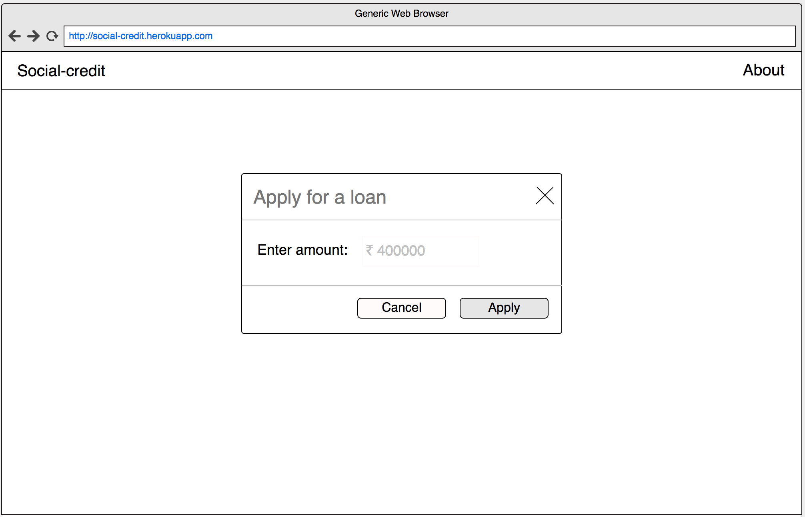
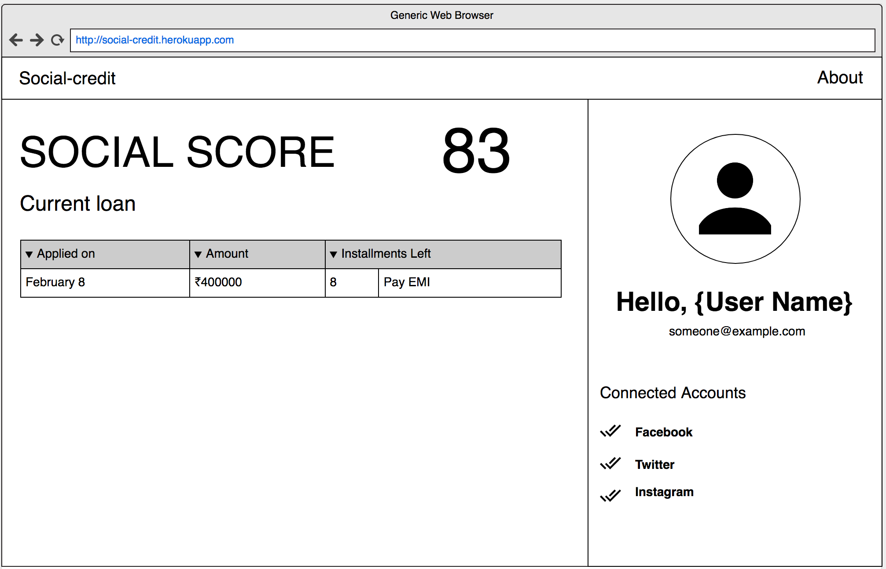
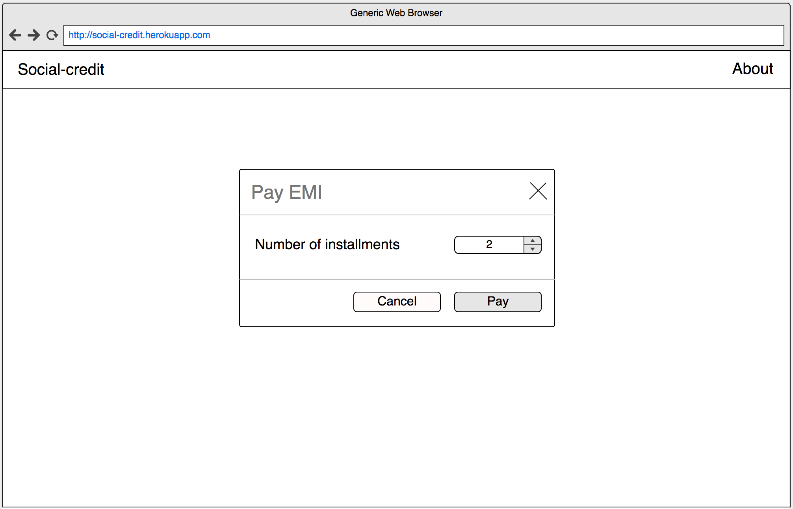
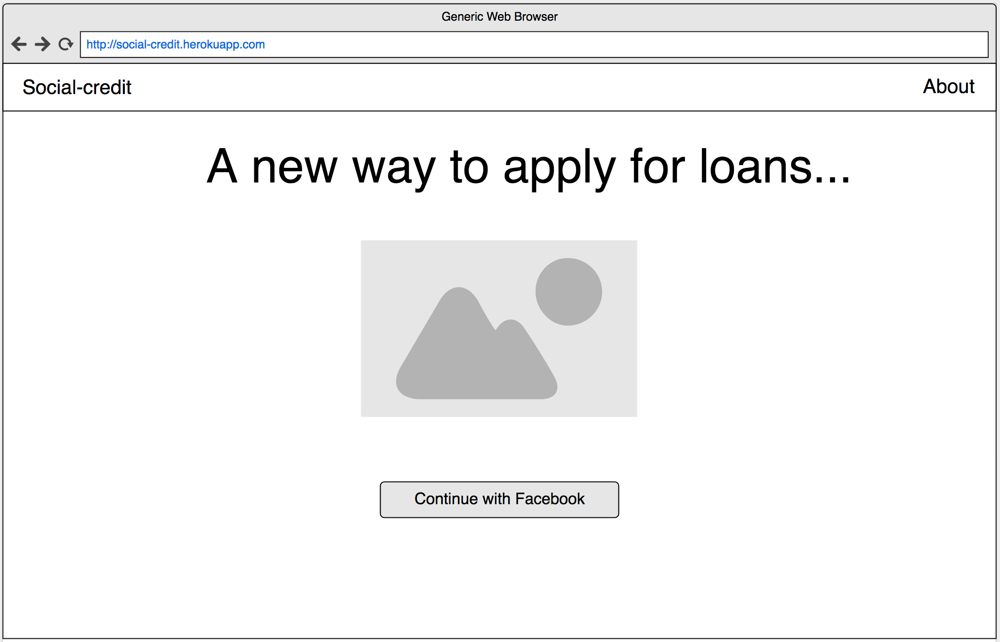

# Components

### `<About />` - Displays the about page

* **Props:**  None
* **State:**  None
* **Functions:** None


```
<TitleBar />

<h1> ABOUT US </h1>

<h2> ... </h2>
<div>
  <p> ... </p> 
</div>

 <p> ... </p>
```
<hr>

### `<ApplyLoan />` - Displays the apply loan popup

* **Props:**  None
* **State:**

```
{
  loanAmount: Number // Stores the loan amount from its child
}
```
* **Functions:** 
```
onApply(event):void // Applies for the loan to the server
onCancel(event):void // Cancels operation and goes back to dashboard
onChange(event):void // Updates its own state based on the input field of its child component
```


```
<TitleBar />
<PopupContainer header={...} content={...} onCancel={...} onApply={...}/>
```
<hr>

### `<Dashboard />` - Displays the user information

* **Props:**  None
* **State:**  
```
{
  social_score: Number, // Social score of user
  user_name: String,
  user_email: String,
  connected_accounts: bool[]
}
```
* **Functions:** 
```
fetchUserData():void // Fetches user data from server and stores it in the state
```


```
<TitleBar />
<div flex-row>
  <div>
    <div flex-row>
      <h1> Social score </h1>
      <h1> {user.score} </h1>
    </div>
    <div> Current loan </div>
    <LoanHistory />
  </div>
  <div>
    
    {user.name}
    {user.email}
    {user.connected_accounts}
  </div>
</div>
```
<hr>

### `<PayEmi />` - Displays the EMI payment popup

* **Props:**  None
* **State:**

```
{
  installments: Number // Stores the number of installments to be paid
}
```
* **Functions:** 
```
onApply(event):void // Pays the number of installments
onCancel(event):void // Cancels operation and goes back to dashboard
onChange(event):void // Updates its own state based on the input field of its child component
```


```
<TitleBar />
<PopupContainer header={...} content={...} onCancel={...} onApply={...}/>
```
<hr>

## Signup/Login

* **Props:**  None
* **State:**  None
* **Functions:** 
```
signupOrLogin():void // Signs up user or logs in to existing account
```

```
<TitleBar />
<h1> ... </h1>

<button> ... </button>
```
<hr>

## Auxilary Components
<hr>

### `<TitleBar />` - Static display of title bar

* **Props:**  None
* **State:**  None
* **Functions:** None
<hr>

### `<PopupContainer />` - Popup menu for taking input

* **Props:**  
```
{
  header: String,     // The header of the popup box
  content: JSX,       // Any input DOM with onChange function bounded to parent
  onCancel: function, // Bound parent function, when the user presses X or cancel
  onApply: function,  // Bound parent function, when the user presses apply
}
```
* **State:**  None
* **Functions:** None
<hr>

### `<LoanHistory />` - Displays loan history as a table

* **Props:**  None
* **State:**  

```
{
  data: Object[] // Arraylike object containing all data in rows
}
```
* **Functions:** 
```
fetchLoanData():void // Fetches the loan information from the server and sets its state
```
<hr>